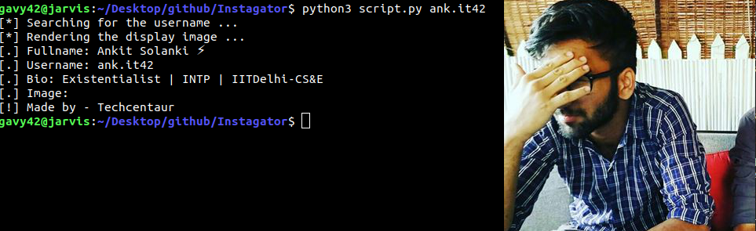

# Instagator
Investigate people on Instagram. Easy as it sounds.

#### What can you do?
- Get Display Pic in High Quality

## Usage

- Run `pip3 install requirements.txt` to install modules.
- Run `python3 script.py <username>` to get started.


#### Terminal Usage



#### Help Usage

```console
gavy42@jarvis:~/Desktop/github/Instagator$ python3 script.py -h
usage: script.py [-h] [-q] username

Instagator: Get Display Pic In High Quality

positional arguments:
  username     Enter the username

optional arguments:
  -h, --help   show this help message and exit
  -q, --quiet  Quiet mode
```

#### Functions Usage

- **About class** - can be instantiated like `Insta(<username>)`.
- `data()` method that will return a list as [bio, fullname, name, image].
